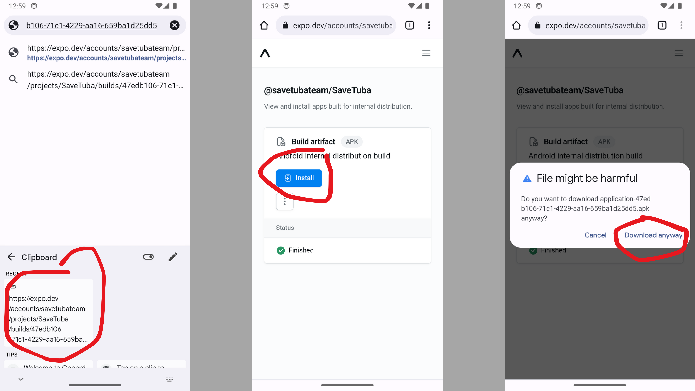
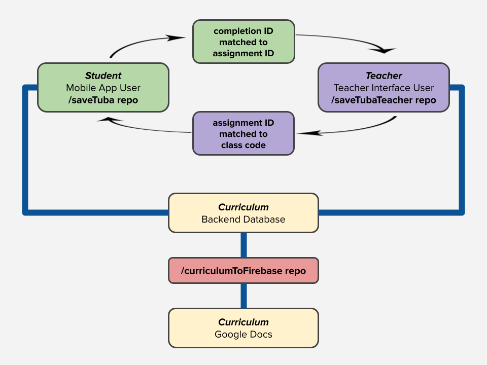

## SaveTuba

Save Tuba (https://savetuba.com/) is an educational platform for environmental sustainability education in Kazakhstan. For a more in-depth project description, please see [PROJECT_DESCRIPTION.md](./readme/PROJECT_DESCRIPTION.md).

This README is the central technical documentation point for the entire set of Save Tuba repositories. Here you will find everything you need to get started with our mobile app. Welcome aboard!

For reference, please see [CLI_CHEATSHEET.md](./readme/CLI_CHEATSHEET.md) for a cheatsheet of important CLI commands.

https://github.com/user-attachments/assets/7e4e0a23-0f91-4243-9f47-b6932478f484

## Table of Contents

* [Learning Resources & General Overview of Tech Stack](#learning-resources--general-overview-of-tech-stack)
* [Environment Setup & Getting Started](#environment-setup--getting-started)
* [Developer Access](#developer-access)
* [Mobile App Deployment](#mobile-app-deployment)
* [Polyrepo Structure & Data Flow](#polyrepo-structure--data-flow)
* [Other](#previous-software-team-leads)

## Learning Resources & General Overview of Tech Stack

The Save Tuba mobile app is written in a Javascript framework called React Native, allowing us to build to both iOS & Android with just Javascript! We also use Expo for native build support; Expo is a set of libraries and build tools that allows us to build React Native apps with ease. We use Redux and RTK Query for state management and data fetching. Firebase is our NoSQL database. React Native and Expo are the [industry preferred solutions](https://evanbacon.dev/blog/expo-2024?x) to developing on both iOS and Android without having to make two separate apps and build pipelines. In order to flatten the learning curve as much as possible, our mobile tech stack closely mirrors our web tech stack so that we only need to learn things once to build everywhere.

This project requires that you have proficiency with Javascript/HTML/CSS and Git/GitHub. For complete beginners, we recommend [The Odin Project](https://www.theodinproject.com/paths/full-stack-javascript). Note that we will be using asynchronous programming regularly. For a review of how to use Git/GitHub, see [the Git book](https://git-scm.com/book/en/v2) or [Git and GitHub for Poets](https://www.youtube.com/watch?v=BCQHnlnPusY&list=PLRqwX-V7Uu6ZF9C0YMKuns9sLDzK6zoiV).

It is highly recommended that you follow tutorials on official documentation sites as opposed to following YouTube tutorials. For this project you **need** to be comfortable reading documentation; blindly copy-pasting from YouTube will get you stuck in "tutorial hell".

- [React Native](https://reactnative.dev/docs/getting-started)
- [Expo](https://docs.expo.dev/tutorial/overview/)
- [Redux](https://redux.js.org/tutorials/essentials/part-1-overview-concepts)
- Firebase (note that we work with the "Web namespaced API")
  - [Firebase Firestore](https://firebase.google.com/docs/firestore/quickstart)
  - [Firebase Authentication](https://firebase.google.com/docs/auth/web/start)
  - [Firebase Cloud Storage](https://firebase.google.com/docs/storage/web/start)

The *only* YouTube channels recommended by the team are:
- [Miss Coding](https://www.youtube.com/@MissCoding) (for Expo/Firebase integration, EAS build, [EAS submit](https://www.youtube.com/watch?v=PdwYDatvJ2I), [Google Sign In](https://www.youtube.com/watch?v=HY3O_wrvDsI), etc.)
- [the official Firebase channel](https://www.youtube.com/@Firebase) (for [tutorials](https://www.youtube.com/watch?v=v_hR4K4auoQ&list=PLl-K7zZEsYLluG5MCVEzXAQ7ACZBCuZgZ), [Firebase Security Rules](https://www.youtube.com/watch?v=QEuu9X9L-MU&list=PLl-K7zZEsYLn8h1NyU_OV6dX8mBhH2s_L))
- [the official Expo channel](https://www.youtube.com/@ExpoDevelopers) (PLEASE SEE: [Debugging app crashes with Keith Kurak from the Expo team](https://www.youtube.com/watch?v=LvCci4Bwmpc))

Other notable packages:
- [React Navigation](https://reactnavigation.org/docs/getting-started) - page router built by the team at Expo
- [React Native Google Sign In](https://react-native-google-signin.github.io/docs/original) - a native module for Google sign-in
- [Lottie](https://airbnb.io/lottie/#/react-native?id=usage) - Airbnb's open source animation library
- [i18next](https://react.i18next.com/) - Javascript internationalization framework. [See here for more](https://locize.com/blog/react-i18next/).

## Environment Setup & Getting Started

Assuming you already have [node](https://nodejs.org/en/download/package-manager) and [git](https://github.com/git-guides/install-git) installed, run the following in a new directory:

```
git clone https://github.com/SaveTubaTeam/saveTuba.git
cd ./saveTuba
npm install
```

Note that `npm install` installs all of the packages listed in our package.json file. Now we need to install a few CLI packages, the first being eas-cli. eas-cli allows us to use [Expo Application Services (EAS)](https://docs.expo.dev/eas/) for building and deploying our app.

```
npm install --global eas-cli
eas login
```

Above, the first command globally installs eas-cli. The second command will prompt you to login to EAS; use our team's [EAS login info](#developer-access) to do so. The `eas whoami` command should verify that you've signed in. 

Next, we install the gcloud CLI. Carefully follow the instructions [here](https://cloud.google.com/sdk/docs/install) to install. We will use gcloud for exporting and importing data from Firebase. The `gcloud --version` command should verify you've installed gcloud correctly once you've done so. Then run:

```
gcloud auth login
```

If you run `gcloud auth list` you should see you've signed in correctly. Next:

```
gcloud config set project savetuba-5e519
```

If you do not yet have admin access to the team's Google Cloud console this command will not work. Otherwise, running `gcloud config list project` should yield `project = savetuba-5e519` in your terminal.

Now, in order to actually run our app, we need two things. One is a valid build of our app, and the other is an emulator to run our build. Let's install our emulators first:

**For both macOS & Windows**, follow the tutorial here to set up Android Studio: https://docs.expo.dev/workflow/android-studio-emulator/

**For macOS only**, follow the tutorial here to set up Xcode: https://docs.expo.dev/workflow/ios-simulator/. Note: it is recommended that you use Android Studio for development because Xcode sucks. Use Xcode for platform-specific testing. We will be using Android Studio for the rest of this setup guide.

And now for the build, **copy and paste the following link in your Android emulator's browser and install the .apk**: https://expo.dev/accounts/savetubateam/projects/SaveTuba/builds/47edb106-71c1-4229-aa16-659ba1d25dd5 (last updated 10/19/24, note that new builds are invalidated after 2 weeks)



.png)

.png)

Open your app on the emulator. Back in your terminal, run the following command to start the development build:

```
npx expo start --dev-client
```

*Note: if you followed Expo's beginner tutorial, you'll notice we **do not** use Expo Go, as React Native Google Sign In is a native module and does not work with Expo Go. So we are using Expo development builds.*

That's it. You're all set up! Try and change some simple things and see how the app updates (almost) instantly.

## Developer Access

After onboarding, you will be granted admin access to a number of resources including the team's shared Google Drive, Firebase, Google Cloud console, and Jira/Confluence. If you do not have access for any reason, please contact our faculty advisor Sean Vassilaros. All other resources, including Expo developer login information, can be found in our shared Google Drive in this excel sheet: https://docs.google.com/spreadsheets/d/1arZ3kNvUUUYryvG9KBVtXL5exw28cFbEZe05KJmE9GI

Using the login info on the above spreadsheet, go to https://expo.dev and log in to see our team's dashboard. You'll also be able to see all of our past and current builds.

Our Firebase security rules and Google Docs API key can be found in the following folder: https://drive.google.com/drive/u/1/folders/1u0ivD2nIwGcX-wS_4ex43hDb3Clj8hAC

## Mobile App Deployment

As a brief overview, the entire build to deployment pipeline for the mobile app looks something like this:

**[commit to github] --> [create eas dev builds] --> [develop in emulator] --> [create eas preview/prod builds] --> [test on phones] --> [deploy prod builds to iOS App Store and Google Play]**

**To create a new dev build for your emulators**, run the following:

```
eas build --profile development --platform {android | ios}
```

**For Android test builds on actual phones**, build a preview profile via `eas build --profile preview --platform android`. Send your Android testers the build link once it's done. They will be able to download and install the build onto their phones.

**For iOS test builds (to be deployed on TestFlight)**, build a production profile via `eas build --profile production --platform ios`. Please follow the tutorial outlined here to upload to TestFlight: https://www.youtube.com/watch?v=PdwYDatvJ2I.

*as of 10/20/24 you are unable to use TestFlight because it is my personal Apple account*

Before moving onto the next step of deploying to production, we need to talk about Firebase Security Rules. Learn more here: https://firebase.google.com/docs/rules

- [Authentication](https://firebase.google.com/docs/rules/rules-and-auth)
- [Language](https://firebase.google.com/docs/rules/rules-language)
- [Behaviour](https://firebase.google.com/docs/rules/rules-behavior)
- [Security Rules Language Reference API](https://firebase.google.com/docs/reference/security/database)

> [!CAUTION]
> Firebase allows us to publicly expose our Firebase API key at heavy risk: misconfigured security rules allow for unfettered read/write access to sensitive data. In order to prevent bad rules, testing should be done in [Firebase's web interface](https://firebase.google.com/docs/rules/simulator) or [via emulator](https://firebase.google.com/docs/firestore/security/test-rules-emulator). **The team implores that you extensively test all rules before deploying.**

Unlike Firebase API keys, traditional API keys such as the Google Docs API key used in [/curriculumToFirebase](https://github.com/SaveTubaTeam/curriculumToFirebase) must be kept a secret and should NOT be committed to our repositories. 

*@jac927 10/20/24 | James: if there are additional API keys that need to be hidden during deployment (currently there are none of this kind) you should look to hide them via Google Cloud Functions.*

TODO: write pushing to prod tutorial once we get our app store and google play accounts

## Polyrepo Structure & Data Flow

**In this section we will answer two questions:**
1. How does the Save Tuba platform work?
2. Why have we architected the system this way?

In order to answer our first question, let us consider the entire set of Save Tuba repositories. As of 2024 we have:

- the **/saveTuba** repo, which houses our mobile app
- the **/saveTubaTeacher** repo, which houses our teacher interface web app
- the **/curriculumToFirebase** repo, which houses a web interface that pushes curriculum content from Google Docs into our Firebase database

Understanding the interaction between these repos requires understanding of our curriculum. Our curriculum is organized in the following manner: 

**[grade] --> [chapter] --> [lesson] --> [minigame]**

In our code, we are able to ID each and every minigame in the following format: G#C#L#_MINIGAME. For example, Grade 1 Chapter 2 Lesson 3 Reorder will look like G1C2L3_Reorder. The minigame's language (Kazakh, Russian, or English) is determined by the user's language preference client-side.

Now let us look at an example interaction between our mobile app and teacher interface repos, in which students are put into classrooms and teachers give assignments to these classrooms.

1. A student on the mobile app is in a classroom with the example classCode **TJOAEM**. They are placed in this class on the app.
2. In the teacher interface, a teacher assigns Grade 2 Chapter 3 Lesson 1 (thereby assigning all of the minigames contained within that lesson) to classCode **TJOAEM**. The assignment ID is **G2C3L1**.
3. On the mobile app, the student sees an assignment for **G2C3L1**. They then complete the minigames in this lesson. Each minigame completion has an ID as follows: **G2C3L1_Quiz**, **G2C3L1_Snapshot**, etc.
4. In the teacher interface, the teacher views their students' progress in class **TJOAEM**. The interface fetches all of the completion documents for each student in class **TJOAEM**. For our particular example student, there is a match between the ID of a completion document and the ID of the assignment. This means the student has completed at least one minigame in the assigned lesson.

A diagram detailing the backend nosql organization of our curriculum can be found here: https://docs.google.com/drawings/d/1ovPMbssiIZCtwBWzquHQSWYXgrC_0DbvGT9WYxYoPXM.  
A diagram detailing the backend nosql organization of users, classrooms, and teachers can be found here: https://docs.google.com/drawings/d/1raQQlftbeLA8N3h1zTlLjwmMHjUmOcFby1Mr6vSp5T0.



Onto the why:

**Q. Why does the teacher interface need only completion IDs?**  
A. In order to minimize the complexity of our system, we pass only IDs back and forth. This minimizes the amount of JSON being changed in our Firebase documents and adheres to typical nonrelational database patterns. That is to say, on the teacher interface, all of the data corresponding to a completion ID can be pulled on-demand using key-value pairs.

**Q. Why does the mobile app need only assignment IDs?**  
A. In keeping with the above answer, we want to pass only IDs to minimize complexity. On the mobile app, all curriculum content is pulled on-demand from our curriculum documents in Firebase. So all we need is to track a student's completions via completion IDs, and then the teacher interface has everything it needs.

**Q. How are students organized into classrooms?**  
A. Each student is prompted to enter a class code on their initial sign-in on the mobile app. In Firebase, this class code is appended to the student's document once it is entered. The class code is also appended to the corresponding teacher's document.

**Q. Why is our curriculum in Google Docs?**  
A. Our non-tech teammates need a comfortable place to write new curriculum. They have decided on Google Docs. The challenge for the software team, then, is to convert all 500+ pages of curriculum documents into scriptable JSON which can be fed into Firebase. This challenge is solved by the script in /curriculumToFirebase

## Previous Software Team Leads

James Chang (team of '24)  
Hayden Ossinger (team of '23)  
Nadja Stojanovic (team of '22)  

Malika Buribayeva (Head of External Relations, team of '23 and '24)  
Malika is from Almaty and has several points of contact in the educational sphere. She is the bridge between us and our external partners. All questions regarding contacts overseas should be directed to her.

## Miscellaneous

Below you can find a collection of my favorite conference talks, tech videos, articles, and dev blogs. Enjoy!

- Josh Comeau's [CSS Blog](https://www.joshwcomeau.com/) ([this](https://www.joshwcomeau.com/css/interactive-guide-to-grid/) and [this](https://www.joshwcomeau.com/css/interactive-guide-to-flexbox/) are must reads!)
- Philip Roberts, ["What the heck is the event loop anyway?"](https://www.youtube.com/watch?v=8aGhZQkoFbQ) (if you watch only one video from this list let it be this one)
- Anjana Vakil, ["Learning Functional Programming with JavaScript"](https://www.youtube.com/watch?v=e-5obm1G_FY)
- Carson Gross, ["The Grug Brained Developer"](https://grugbrain.dev/)
- Rich Hickey, ["Hammock Driven Development"](https://www.youtube.com/watch?v=f84n5oFoZBc&t=856s)
- Michael Chan, ["Hot Garbage: Clean Code is Dead"](https://www.youtube.com/watch?v=-NP_upexPFg)
- Theo Browne, ["Deploying on Fridays"](https://www.youtube.com/watch?v=nCK0ey0qqsk)
- Stripe's [dev blog](https://increment.com/)
- Ben Awad on ["Best Practices"](https://www.youtube.com/watch?v=gc8mDZwUlfo)
- Ben Orenstein, ["How to talk to developers"](https://www.youtube.com/watch?v=l9JXH7JPjR4)
- Arthur O'Dwyer's [C++ Blog](https://quuxplusone.github.io/blog/2023/11/20/roast-pig/)
- Rich Harris, ["Rethinking reactivity"](https://youtu.be/AdNJ3fydeao?si=QgQEFlq1wHa9G9OC)
- Saron Yitbarek, ["Transitions: the easiest way to improve your tech talk"](https://medium.com/@saronyitbarek/transitions-the-easiest-way-to-improve-your-tech-talk-ebe4d40a3257)
- Theo Browne, ["Rethinking the Technical Interview"](https://www.youtube.com/watch?v=H2OjewTu_fY)